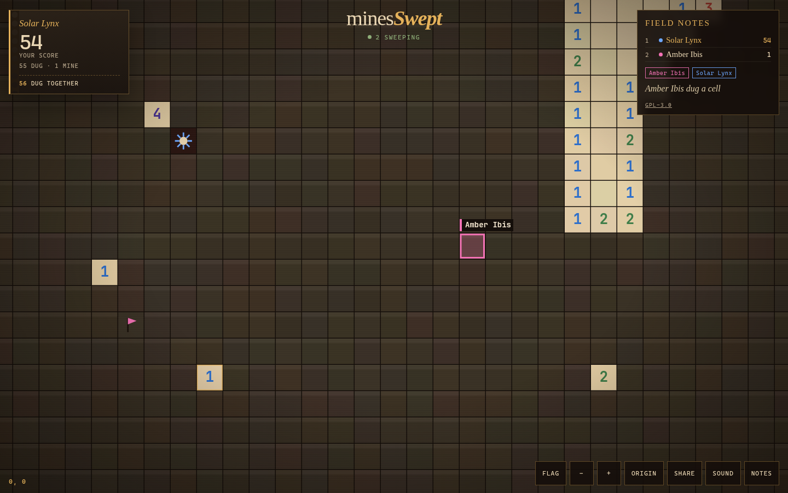
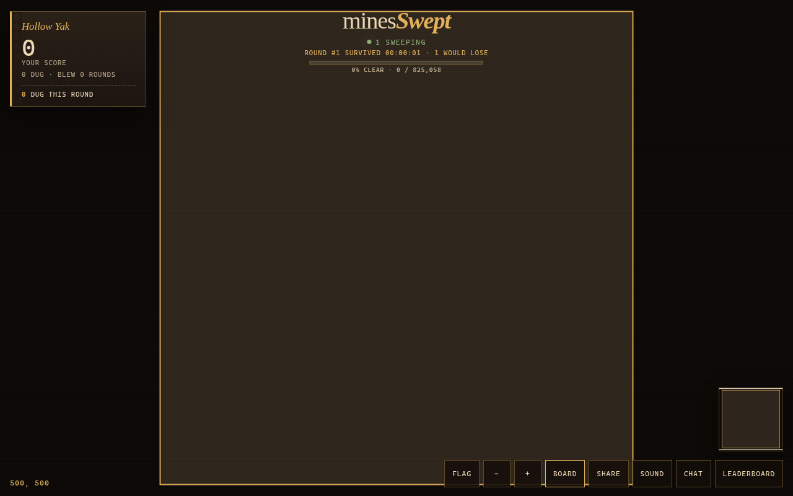
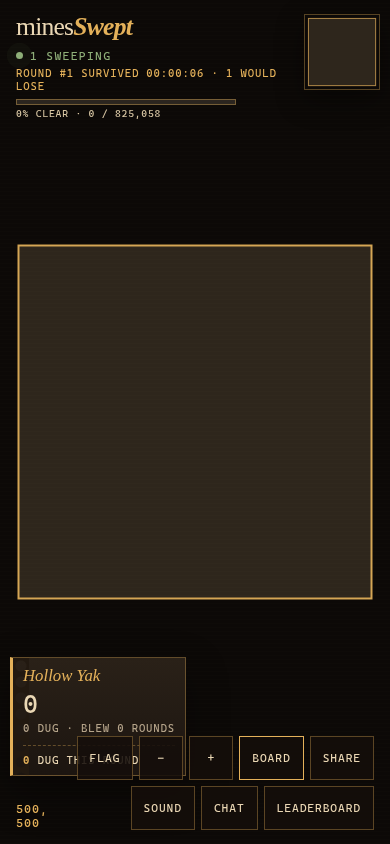
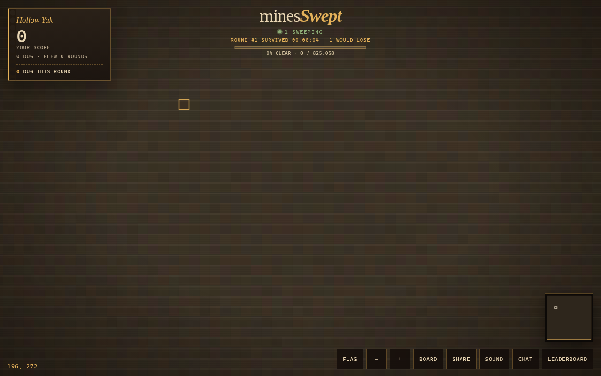
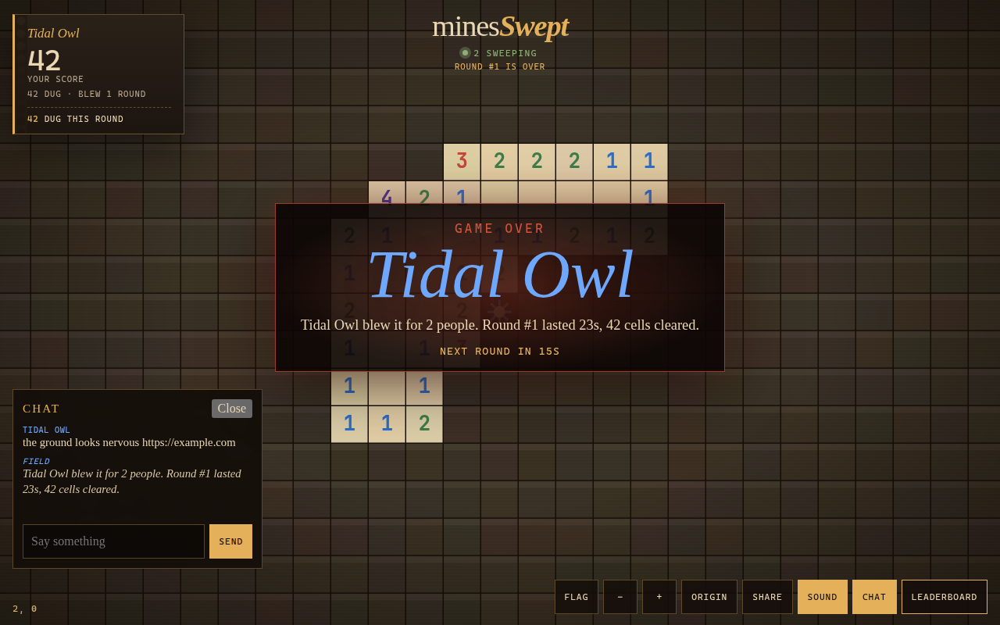
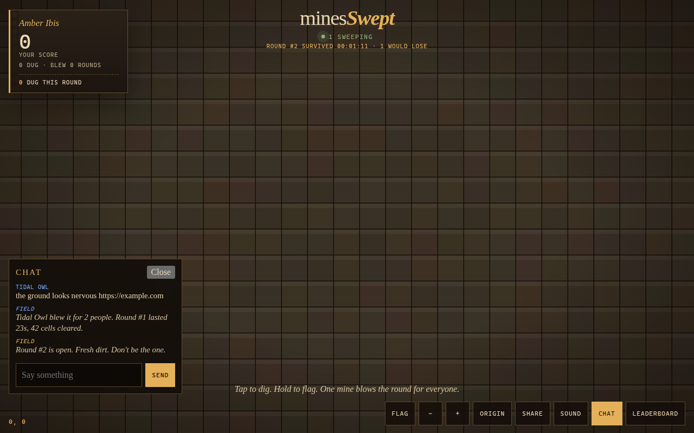

# minesSwept

One shared minesweeper round. Everyone who opens the site is digging in the same dirt. If anyone hits a mine, the round is over for everybody, and the person who did it gets a playful public shaming. Then a fresh board starts.

No accounts. You get a name and a color, you can change the name, and you play. Other people show up as cursors. There is one global chat. The longest anyone has kept a round alive is the number worth bragging about.

Built to be opened from a link and understood in about five seconds.



## Play

| | |
|---|---|
| Dig | Click or tap a hidden cell |
| Flag | Right-click, or press and hold, or toggle Flag |
| Chord | Tap a number whose flags already match it |
| Move | Drag, middle-drag, or arrow keys |
| Zoom | Scroll, pinch, + / −, or double-click / double-tap a spot |
| Whole board | Board button, or the minimap |

Each round is one closed board, 1,000 by 1,000 (a million cells). Cells outside that square do not exist. Past the edge there is only the dark ground and a thin line on the board, with nothing to click. You can pan a little past that line, and the board stays on screen. Zooming all the way out fits the whole board. Mine density stays at 17.5% (1,750 mines in every 10,000 cells), the same as before. That keeps openings and numbers feeling the way they do on a small patch. A thinner field would make a clear write more rows and open larger floods. A thicker field would turn a win into a wall of mines. A full board is about 175,000 mines and 825,000 safe cells.

Untouched ground will not end the round: if you dig a mine that nobody's numbers depend on yet, the mine is pushed somewhere else and your dig stands. Once a cell is next to opened ground, the numbers are locked. Hitting that mine ends the round for every player at once. The banner names who did it, how long the round lasted, how many cells were cleared, and how many people were on it. Mines around the blast are shown. After 15 seconds a new seed, an empty board, and the next round number start on their own. Safe cells are worth 1 point for that round. Scores reset with the board. The hall of shame, the hall of fame, and the longest-round record stay.

The round is also won, by everyone still there, when every safe cell is open. The same 15 second pause follows, then a new board. The win card names how long it took and who dug the most. The header shows how much of the board is clear.

Zoom out far enough and the field draws as an overview: revealed ground, flags, the blast, and live players, at about one pixel a cell or less. The server keeps an 8×8 summary and sends only the bins that changed, so a frame is never a million cells. Zoom back in and the cells are the same as before. The minimap stays on screen. A tap on the overview zooms toward that spot instead of digging.







A round cannot be thrown in its first 20 seconds. During that grace, a frontier mine is moved instead of detonating. The player who just ended a round also cannot end the next one: their frontier mines are moved, and the field tells them this one isn't theirs to blow. One person cannot reset the game forever. Someone else has to do it. A win clears that block, so the next round is open to everyone. History lasts.

Chat is one room on the same connection. The last hundred messages are kept for people who arrive late. Game-over lines are posted there automatically. One message every two seconds, 200 characters, plain text (a URL shows up as text and is not a link). A short server-side list rejects racial slurs, including spacing, leetspeak, repeated letters, and symbol swaps. Ordinary swearing is fine. The sender sees "Message not sent" and nobody else sees it. The same check applies to display names. The list itself is not printed here.





## Run it locally

```bash
make dev
```

Open http://localhost:8787 in two windows. Both are on the same board. State is written to `.wrangler/state` and survives a restart of `wrangler dev`.

```bash
make test
```

Unit tests cover chunk-and-seed mine generation, flood fill, mine relocation, detonation, chords, server-side rejection, the closed board, win detection, the overview summary, the slur filter (including evasions), chat length and rate limit, grace, the shield, and the shame line. Two wrangler tests connect real clients: one checks that a flag and a dig are shared and that hidden mines stay on the server, and the other checks chat, a blocked slur, a round ending for both players, the automatic next round, and that the hall of shame is still there after a restart.

## Deploy

`make deploy` runs `wrangler deploy`. It expects `CLOUDFLARE_API_TOKEN` and `CLOUDFLARE_ACCOUNT_ID` in the environment. The repo has no tokens and does not ask for any.

### One-time setup

1. Install [Wrangler](https://developers.cloudflare.com/workers/wrangler/) via `npm install` (the Makefile does this).
2. Create an API token that can edit Workers on the account that owns the `telep.io` zone. Export it as `CLOUDFLARE_API_TOKEN`, and export `CLOUDFLARE_ACCOUNT_ID`.
3. `wrangler.toml` already contains the custom domain route:

   ```toml
   [[routes]]
   pattern = "mines.telep.io"
   custom_domain = true
   ```

   The first successful deploy creates the `mines.telep.io` DNS record on that zone. The zone has to be in the same Cloudflare account. If you only want the `*.workers.dev` hostname first, comment those three lines out, deploy, then put them back.
4. Open https://mines.telep.io. Share cards are generated at `/og.png`. Live totals are at `/api/stats`.

Deploys restart the Durable Object and disconnect open sockets. History and chat stay. The first boot of this version, if it finds a board that is not already 1,000 by 1,000, ends that open round without writing a shame row, keeps the hall of shame and the chat, deletes the deploy-check player `deploycheck-bot01`, and starts the next round on a fresh 1,000 by 1,000 board. Players with zero digs are left off the public leaderboard.

## Architecture

One Cloudflare Worker serves the static client and routes `/ws`, `/api/*`, and `/og.png` to a single SQLite-backed Durable Object named `world`.

Mines are not stored. A world seed plus the cell coordinate decides them, so the unrevealed field is not written down. Overrides (a relocated mine, or a mine planted to stop a runaway flood) and opened cells live in SQLite. Clients only ever receive cells that are already revealed or flagged. Far zoom uses a second table of 8×8 bins and a short binary summary, not the cell list.

Presence uses the WebSocket Hibernation API. The object sleeps between messages, which is what keeps the daily duration quota intact. Cursors are throttled and only forwarded to people looking at that patch. A dig is applied on the object, saved, and broadcast. There is one object on purpose: a shared board needs one authority, and one hibernating object can hold the sockets for a few hundred players. Splitting the field would make floods and the scoreboard lie.

## Free plan

Durable Objects with the SQLite backend are included on the Workers Free plan. The paid plan is not required to deploy or to run a normal launch. Figures below are from Cloudflare's pricing and limits docs as of 30 Sep 2026.

| Limit | Free allowance | What this game does |
|---|---|---|
| Worker requests | 100,000 / day | Static files are unlimited and do not count. The Worker runs for the WebSocket upgrade, `/api/stats`, and `/og.png`. |
| Worker CPU | 10 ms / request | The Worker only forwards. Game work runs in the Durable Object. |
| Durable Object requests | 100,000 / day | Incoming WebSocket messages are billed 20:1, so 2,000,000 incoming messages fit. Outgoing broadcasts are free. A connection setup counts as one request. |
| Durable Object duration | 13,000 GB-s / day | Hibernation means duration accrues only while a message is handled, not while people sit connected. |
| Durable Object CPU | 30 s / invocation by default | A single dig is capped at 400 cells. |
| SQLite rows read | 5 million / day | Viewport reads and per-cell lookups. |
| SQLite rows written | 100,000 / day | One row per revealed or flagged cell, plus one row per chat line. This is the tight quota. |
| SQLite stored | 5 GB / account, 1 GB / object | Opened cells, mine overrides, and at most 15,625 overview bins. One fully opened round is on the order of tens of megabytes. |

Past a free-tier cap, that class of operation fails until 00:00 UTC. The client reconnects and the board is still there.

A 1,000×1,000 round has about 825,000 safe cells. Clearing every one writes one SQLite row per cell, about eight times the free-plan daily write quota, so a finished board does not fit in a single free-plan day. The round keeps the cells it has and continues after 00:00 UTC. Ending the round deletes one row per opened cell, the same order of work. The overview never sends the million cells. The worst case is every 8×8 bin touched: 125×125 bins × 5 bytes = 78,125 bytes raw, under 100 KB, and only the bins that changed are written or broadcast. A dig updates a few of those bins.

A rough fit: 80 people, each sending a cursor every couple of seconds and digging every few seconds, is on the order of 10,000 billed Durable Object requests per hour. Chat is on that same budget. Incoming messages bill 20:1, so a person chatting at the cap (one line every two seconds) adds about 1,800 billed requests an hour. A few dozen people talking steadily is fine for an afternoon. A crowd all chatting at the cap also writes one SQLite row per line, and 100,000 writes a day is only a little over one write a second on average, so a busy room can spend the write quota before the request quota. A few hours of a popular post fits. A couple hundred people, panning and typing all day, can spend the daily budget. The $5 Workers Paid plan raises the ceiling (1 million Durable Object requests included per month, then $0.15 per million) and is not part of this deploy.

Per connection the server allows a handful of digs per second, a cell budget that refills, and at most 8 sockets from one IP. The object stops accepting new sockets around 500.

## License

GPL-3.0. See [LICENSE](LICENSE).
